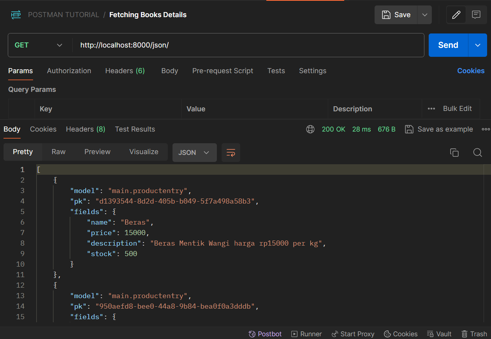
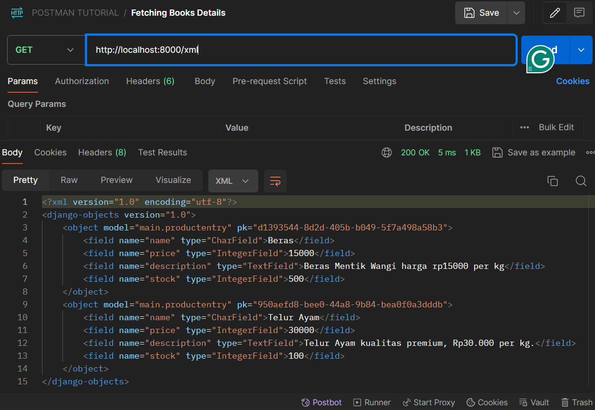
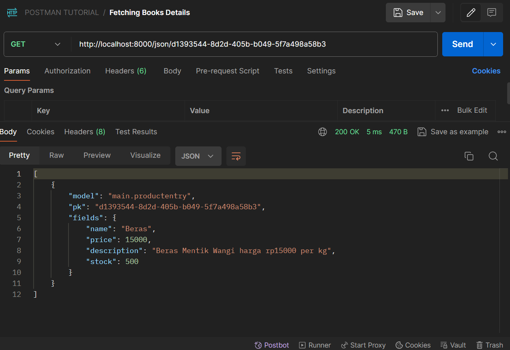
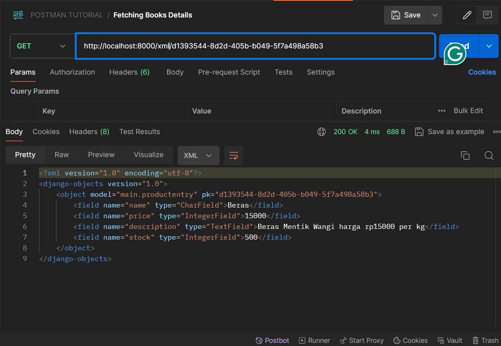

# Tugas PBP Gasal 2024/2025
### M. Arvin Wijayanto - 2306259780 - Kelas D
### Nama Proyek: GROSA

## Tautan Deployment
Deployment tugas Individu PBP Gasal ini dapat dilihat pada m-arvin-grosa.pbp.cs.ui.ac.id

## Penggunaan data delivery dalam pengimplementasian platform
Data delivery penting karena memungkinkan komunikasi antara berbagai komponen dalam platform. Data delivery memastikan bahwa informasi dapat dikirimkan dengan aman, cepat, dan efisien dari satu titik ke titik lain, baik antar server, klien, maupun antar aplikasi. Tanpa mekanisme ini, platform tidak dapat berfungsi secara maksimal, karena data yang dibutuhkan untuk melakukan berbagai tugas tidak dapat dipertukarkan dengan benar.

## XML atau JSON? Mengapa JSON lebih populer?
Secara umum, JSON lebih disukai dibandingkan XML untuk pengiriman data dalam pengembangan aplikasi modern. Alasannya adalah sebagai berikut:

- Keringkasan: JSON lebih ringkas dibandingkan XML, karena tidak memerlukan tag penutup yang berulang-ulang. Hal ini membuat JSON lebih efisien dalam hal penyimpanan dan pengiriman data.
- Kemudahan penggunaan: JSON lebih mudah dibaca dan ditulis, baik oleh manusia maupun oleh mesin, karena menggunakan sintaks yang lebih sederhana.
- Dukungan langsung dari JavaScript: JSON secara alami terintegrasi dengan JavaScript, menjadikannya lebih mudah diimplementasikan dalam aplikasi web.
Walaupun XML menawarkan beberapa fitur tambahan seperti skema untuk validasi dan namespace, JSON lebih populer karena sifatnya yang lebih ringan dan mudah diimplementasikan, terutama dalam aplikasi web modern.

## Fungsi method `is_valid()` pada form Django
Method is_valid() pada form Django digunakan untuk memvalidasi data yang dimasukkan ke dalam form. Method ini mengecek apakah data yang di-submit oleh user sesuai dengan aturan validasi yang telah ditentukan di form. Jika data valid, method ini akan mengembalikan True, dan data tersebut bisa diproses lebih lanjut (misalnya, disimpan ke database). Jika data tidak valid, method ini mengembalikan False dan akan memberikan pesan error yang sesuai.

Tanpa method is_valid(), kita tidak bisa memastikan bahwa data yang masuk aman dan sesuai dengan aturan yang telah dibuat. Ini penting untuk menjaga integritas data dan keamanan aplikasi.

## Mengenai `csrf_token` dalam membentuk Django form
csrf_token digunakan untuk melindungi aplikasi web dari serangan CSRF (Cross-Site Request Forgery). Serangan CSRF terjadi ketika seorang penyerang mengirimkan permintaan berbahaya ke server atas nama pengguna yang telah terautentikasi.

Jika kita tidak menambahkan csrf_token pada form Django, penyerang dapat membuat skrip atau link yang secara otomatis mengirimkan request ke server kita dengan memanfaatkan kredensial pengguna yang sedang aktif. Tanpa token ini, server tidak dapat memverifikasi apakah permintaan yang diterima berasal dari sumber yang sah, sehingga memungkinkan penyerang untuk melakukan tindakan yang tidak diinginkan atas nama pengguna tersebut, seperti mengubah data atau melakukan transaksi tanpa izin.

## Langkah implementasi 
### Pembuatan form
1. Membuat form di Django 
2. Membuat view untuk input form
3. Membuat template HTML untuk menampilkan form
4. Melakukan URL routing untuk form 
### Fungsi views
1. Membuat fungsi untuk melihat json dan xml
2. Membuat fungsi untuk melihat json dan xml berdasarkan ID
3. Menambahkan routing url untuk views tersebut

## Screenshot Postman
### JSON

### XML

### JSON by ID

### XML by ID
