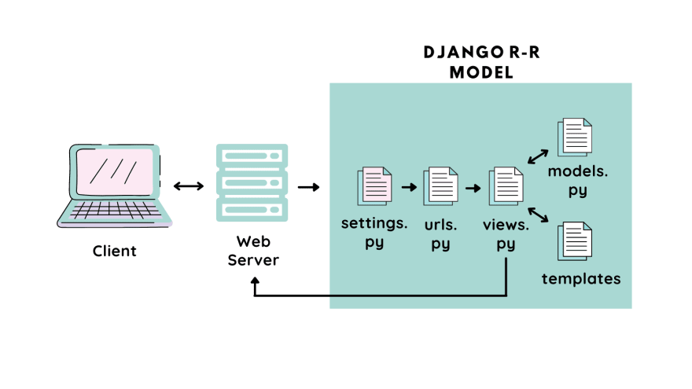

# Tugas PBP Gasal 2024/2025
### M. Arvin Wijayanto - 2306259780 - Kelas D
### Nama Proyek: GROSA

## Tautan Deployment
Deployment tugas Individu PBP Gasal ini dapat dilihat pada ...

## Langkah Implementasi
### 1. Membuat proyek Django baru
Setelah melakukan setup yang diperlukan seperti menyalakan virtual enviornment dan meng-install Django,langkah pertama untuk inisialisasi proyek Django baru adalah melalui perintah ```django-admin startproject [nama_proyek]```. Perintah ini akan membuat struktur direktori dasar yang dibutuhkan untuk proyek Django.

### 2. Membuat aplikasi main pada proyek
Setelah proyek dibuat, aplikasi main harus ditambahkan menggunakan perintah ```python manage.py startapp main```. Nantinya, aplikasi ini akan berisi semua logika dan fitur yang akan dikembangkan.

### 3. Melakukan routing agar dapat menjalankan aplikasi main
Supaya aplikasi main terhubung, perlu ditambahkan rute (route) untuk mengarahkan permintaan (request) ke aplikasi main dalam berkas ```urls.py``` proyek.

### 4. Membuat model pada aplikasi main
Pada ```models.py``` di dalam aplikasi main, tambahkan model ```Product``` yang mewakili entitas produk. Model ini akan memiliki atribut yang wajib seperti ```name```, ```description```, ```price```, dan beberapa atribut lain yang akan digunakan untuk menyimpan data produk ke dalam database.

### 5. Membuat fungsi views untuk dikembalikan pada template
Selanjutnya, buatlah direktori baru bernama templates pada aplikasi main. Di dalam direktori ini, buatlah file ```main.html```. Template ini akan menampilkan informasi seperti nama aplikasi, nama lengkap, dan kelas PBP, yang akan diambil oleh fungsi pada ```views.py``` .

### 6. Melakukan routing pada urls aplikasi main
Di ```urls.py``` pada aplikasi "main", tambahkan rute baru yang akan memetakan URL ke fungsi di ```views.py```. Hal ini memungkinkan pengguna untuk mengakses halaman yang telah dibuat melalui URL yang sesuai.

### 7. Melakukan deployment ke PWS
Setelah aplikasi siap, lakukan deployment ke Pacil Web Service (PWS). Hal ini dilakukan untuk mengunggah proyek ke server PWS sehingga aplikasi dapat diakses melalui Internet.

## Web Aplikasi berbasis Django


Ketika klien mengirimkan request ke web server, Django pertama-tama mengarahkannya ke ``` urls.py ```, yang berfungsi sebagai router. Di sini, permintaan tersebut dicocokkan dengan pola URL tertentu. Setelah ditemukan kecocokan, permintaan diteruskan ke fungsi yang ada di ``` views.py ```. Di dalam ``` views.py ```, logika aplikasi diproses, seperti menangani data dari permintaan atau melakukan operasi tertentu. Jika data dari database dibutuhkan, ``` views.py ``` akan berkomunikasi dengan ``` models.py ```, yang bertindak sebagai jembatan antara logika aplikasi dan database. ``` models.py ``` inilah yang bertanggung jawab atas pengelolaan data, seperti pengambilan, penyimpanan, dan pembaruan informasi dalam basis data.

Setelah data yang diperlukan diperoleh, ``` views.py ``` akan mengirimkan data tersebut ke ``` berkas HTML ``` atau template untuk dirender ke dalam format yang dapat ditampilkan di browser klien. Template ini digunakan untuk menampilkan data dalam bentuk yang lebih interaktif dan user-friendly. Setelah dirender, respon dalam bentuk HTML dikirim kembali ke klien sebagai ``` response ```, yang kemudian ditampilkan di browser pengguna.

## Fungsi git dalam pengembangan perangkat lunak
Git berfungsi sebagai sistem kontrol versi (Version Control System) yang memungkinkan pengembang perangkat lunak untuk melacak setiap perubahan kode secara terperinci. Dengan Git, tim pengembang dapat bekerja secara kolaboratif pada proyek yang sama, mengelola cabang (branch) yang berbeda untuk fitur baru, memperbaiki bug, dan menggabungkan perubahan (merge) dengan aman. Git juga memungkinkan rollback ke versi sebelumnya jika terjadi kesalahan, sehingga meminimalisir risiko dalam pengembangan perangkat lunak. Dengan kata lain, Git membantu menjaga integritas kode dan memastikan tim dapat bekerja secara efisien dalam proyek yang kompleks.

## Django sebagai Permulaan Pembelajaran
Django sering dijadikan framework pengenalan karena mendukung pengembangan cepat (rapid development) dan mengikuti praktik terbaik seperti arsitektur Model-View-Template (MVT). Kesederhanaannya memudahkan pemula untuk memahami konsep dasar seperti routing, templating, dan manajemen database tanpa terbebani oleh kode yang berlebihan. Selain itu, dokumentasi yang kuat dan komunitas yang besar membuatnya lebih mudah bagi pemula untuk mencari sumber belajar dan solusi.

## Django sebagai ORM
Model Django disebut ORM karena memungkinkan pemetaan objek Python ke dalam database relasional. Dengan ORM, pengembang dapat mengelola database menggunakan kode Python tanpa harus menulis kueri SQL secara langsung. ORM mengabstraksi interaksi dengan database, sehingga mempermudah pengelolaan data dan menjaga kode tetap konsisten dan mudah dipahami.